# 📡 Telecom 360° Strategy & Predictive Analytics Hub

**A complete Power BI decision-support system for telecom operators.**  
From executive dashboards to predictive analytics and scenario planning.

---

## 🎯 Project Overview

This project delivers a **complete strategic decision-support system** for a telecom operator.

It transforms raw operational data into:

- ✅ **Executive dashboards** (CEO-level view with 6 KPIs)
- ✅ **Predictive analytics** (churn risk & revenue forecasting)
- ✅ **Scenario planning** (what-if analysis for 5-year investments)
- ✅ **Customer journey tracking** (satisfaction, churn, LTV)
- ✅ **Network operations monitoring** (downtime, MTTR, resolution rate)

> **Business Impact:** Reduce churn by 8%, increase profit margin to 24.9%, and optimize LTV/CAC to 17.20.

---

## 📑 Dashboard Pages (8 Interactive Views)

| # | Page Name | Business Question |
|---|---|---|
| 01 | Executive Strategy | What is the health of the business in 6 KPIs? |
| 02 | Commercial Hub | Where does each dollar go? (CAC, CLV, ROI) |
| 03 | Customer Experience | Why do customers stay or leave? |
| 04 | Network Operations | What happens behind the scenes? (Downtime, MTTR) |
| 05 | Predictive Analytics | What will happen in the next 3 quarters? |
| 06 | Scenario Planner (Manual) | What if I invest 5 years in quality only? |
| 07 | Scenario Planner (Ready) | What is the ready-made recommendation? |
| 08 | Executive Insights | What are the top 10 lessons from the past? |

> Each page solves a specific business problem and answers a "what-if" question.

---

## 📸 Dashboard Screenshots

### Main Dashboards

| Page | Screenshot |
|---|---|
| Interface | 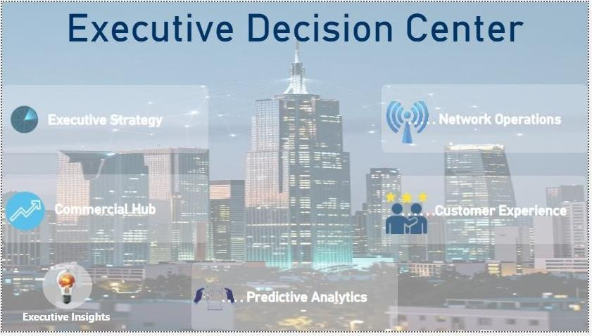 |
| Executive Strategy | 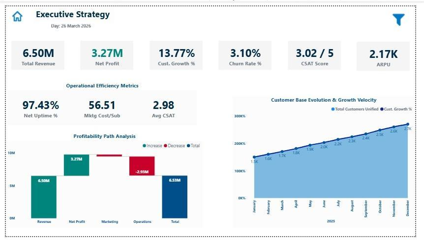 |
| Commercial Hub | 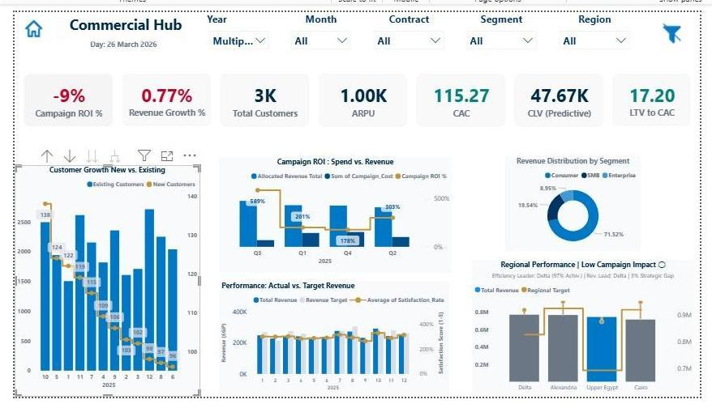 |
| Customer Experience | 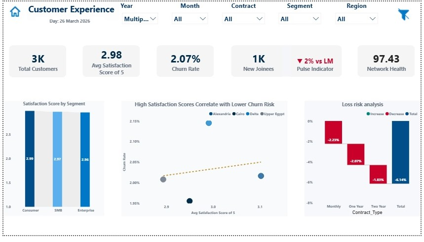 |
| Network Operations | 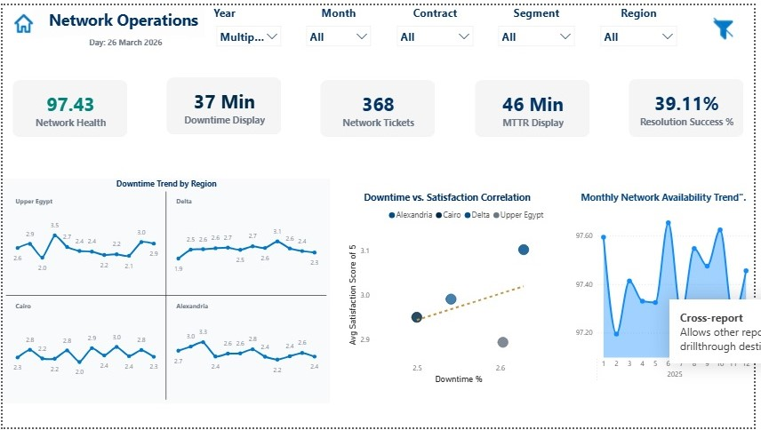 |
| Executive Insights | 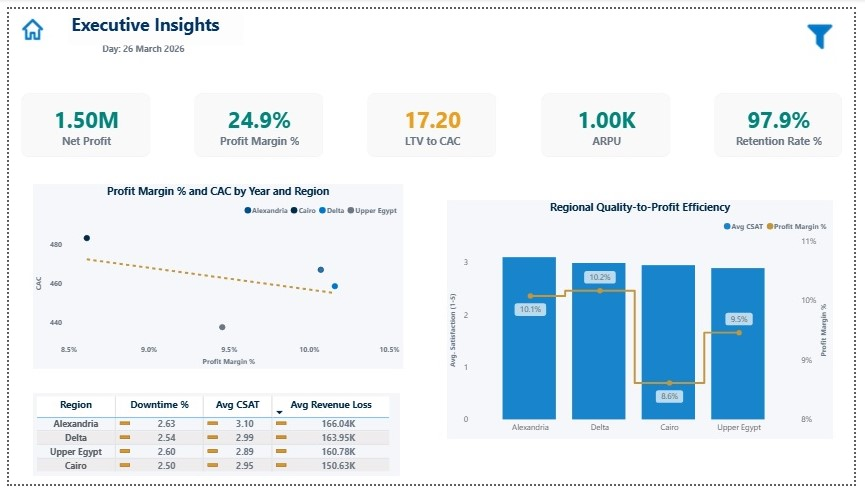 |
| Predictive Analytics | 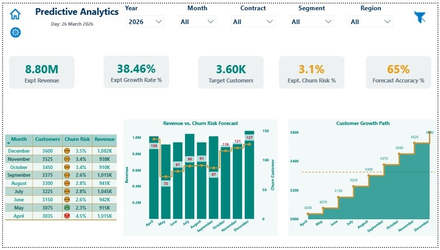 |
| Scenario Planner (Manual) | 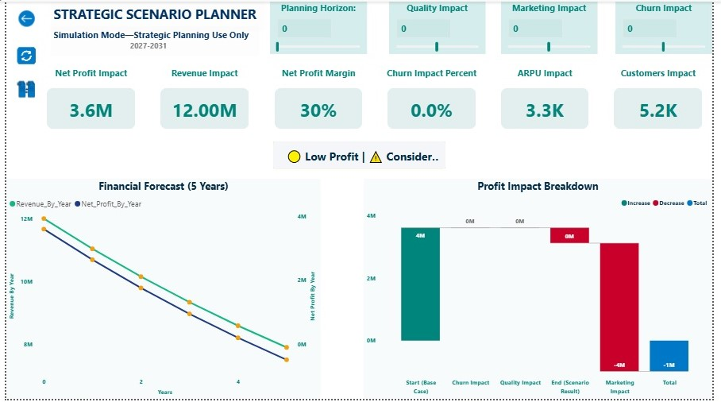 |
| Scenario Planner (Ready) | 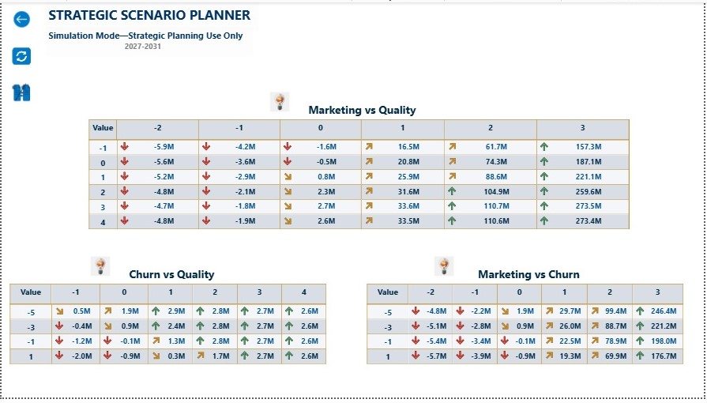 |

### Tooltip Views (Interactive Details)

| Parent Page | Tooltip Screenshot |
|---|---|
| Commercial Hub | 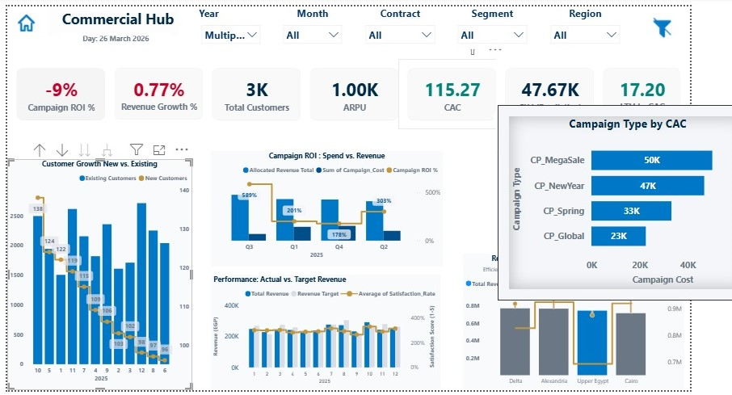 |
| Network Operations | 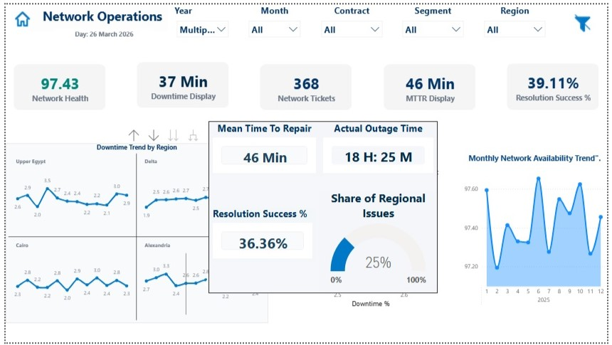 |
| Scenario Planner (Manual) |  |
| Scenario Planner (Ready) | 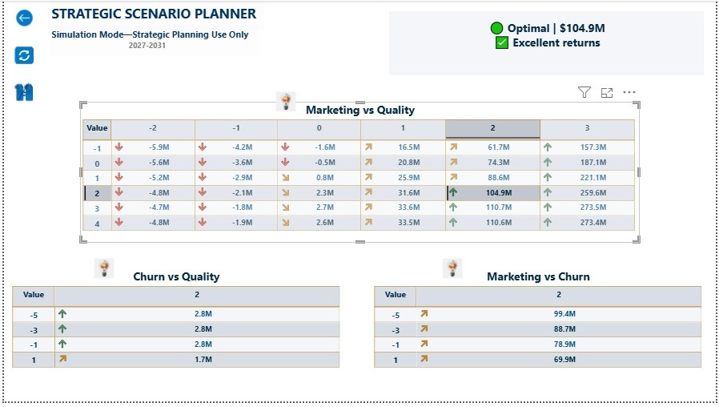 |

> **Note:** Tooltip screenshots show additional insights that appear when hovering over specific elements in the dashboards.

---

## 🎬 Demo Video

Watch the full walkthrough (8 episodes covering all dashboards):

[▶️ Watch Demo Video](04_Video/dashboard_demo.mp4)

---

## 📁 Project Structure

```
Telecom 360° Strategy & Predictive Analytics Hub/
│
├── 01_Data/                    # Raw data files (CSV, XLSX)
│   ├── customers.csv
│   ├── network_logs.csv
│   └── financials.xlsx
│
├── 02_DAX/                     # DAX measures
│   └── DAX_Measures.md         # Complete list of measures
│
├── 03_Images/                  # Dashboard screenshots (13 images)
│   ├── 01_Interface.jpg
│   ├── 02_Executive_Strategy.jpg
│   ├── 03_Commercial_Hub.jpg
│   ├── 04_Commercial_Hub_Tooltip.jpg
│   ├── 05_Customer_Experience.jpg
│   ├── 06_Network_Operations.jpg
│   ├── 07_Network_Operations_Tooltip.jpg
│   ├── 08_Executive_Insights.jpg
│   ├── 09_Predictive_Analytics.jpg
│   ├── 10_Scenario_Planner_Manual.jpg
│   ├── 11_Scenario_Planner_Manual_Tooltip.jpg
│   ├── 12_Scenario_Planner_Ready.jpg
│   └── 13_Scenario_Planner_Ready_Tooltip.jpg
│
├── 04_Video/                   # Demo video
│   └── dashboard_demo.mp4
│
├── 05_Reports/                 # Power BI report
│   └── Telecom_Hub.pbix
│
└── README.md                   # Project documentation
```

---

## 📐 Key DAX Measures (Examples)

### 1. LTV to CAC Ratio
```dax
LTV_to_CAC = DIVIDE([CLV_Predictive], [CAC_Total], 0)
```

### 2. Churn Risk (Monthly)
```dax
Churn_Risk_Monthly = 
CALCULATE(
    COUNTROWS(Customers),
    Customers[Churn_Probability] > 0.05
) / COUNTROWS(Customers)
```

### 3. Dynamic Profit Margin
```dax
Profit_Margin = 
DIVIDE(
    [Net_Profit],
    [Total_Revenue],
    0
) * 100
```

### 4. Campaign ROI
```dax
Campaign_ROI = 
DIVIDE(
    [Campaign_Revenue] - [Campaign_Cost],
    [Campaign_Cost],
    0
) * 100
```

> 📁 Full list of 25+ measures available in: [`02_DAX/DAX_Measures.md`](02_DAX/DAX_Measures.md)

---

## 💡 Key Insights from the Analysis

| Insight | Metric | Action |
|---|---|---|
| Campaign ROI is negative (-9%) | ROI | Stop current campaigns immediately |
| LTV/CAC is excellent (17.20) | LTV/CAC | Invest more in acquisition channels |
| Customer satisfaction is low (2.98/5) | CSAT | Focus on experience, not network |
| Resolution success rate is only 39% | MTTR | Improve field team efficiency |
| Alexandria has highest profit margin | Regional | Replicate Alexandria model to other regions |
| Churn risk grows to 8% in 2 years | Churn | Intervene before it's too late |
| Network health is good (97.43%) | Uptime | Maintain current infrastructure |
| Profit margin target (24.9%) achieved | Margin | Continue current strategy |

---

## 🚀 How to Run the Project

### Prerequisites
- Power BI Desktop (October 2023 or later)
- Windows 10/11

### Steps

1. **Clone the repository**
   ```bash
   git clone https://github.com/MAHMOUDHEMEIDA/Telecom-360-Strategy-Hub.git
   ```

2. **Open the report**
   - Open `05_Reports/Telecom_Hub.pbix` in Power BI Desktop

3. **Configure data sources**
   - Make sure data sources point to `01_Data/` folder

4. **Refresh data** (if needed)

5. **Explore the dashboards**
   - Use the tabs at the bottom to navigate between 8 dashboards

---

## 🔮 Future Work (Roadmap)

- [ ] Integrate real-time network alerts using Power BI Streaming
- [ ] Add Python integration for advanced churn prediction (ML models)
- [ ] Deploy to Power BI Service for executive mobile access
- [ ] Add Arabic language support for local teams
- [ ] Automate data refresh from source systems (API)
- [ ] Add more what-if scenarios for pricing strategy

---

## 🛠️ Tools Used

| Tool | Purpose |
|---|---|
| Power BI Desktop | Dashboard development |
| DAX Studio | Measure extraction & optimization |
| Power Query | Data cleaning & transformation |
| Excel / CSV | Data sources |
| Git & GitHub | Version control |

---

## 👤 Author

**Mahmoud Hemeida**

- 📧 mahmoud.hemieda@example.com
- 🔗 [linkedin.com/in/mahmoud-hemeida](https://linkedin.com/in/mahmoud-hemeida)
- 🐙 [github.com/MAHMOUDHEMEIDA](https://github.com/MAHMOUDHEMEIDA)

---

## 📄 License

This project is licensed under the MIT License - see the [LICENSE](LICENSE) file for details.

---

## 🙏 Acknowledgments

- Data source: Telecom Operator Simulation Data
- Inspired by real-world telecom strategic planning challenges
- Thanks to the Power BI community for DAX inspiration

---

## ⭐ Show Your Support

If this project helped you or inspired your work, please consider giving it a star on GitHub!

---

**Built with ❤️ for data-driven decision making**